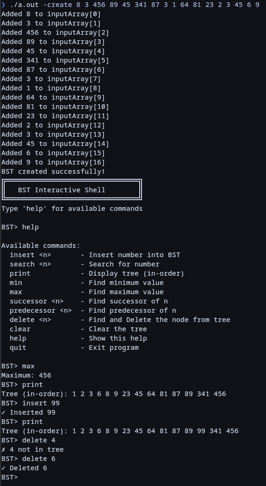

# Data-Structures-by-Nikhil-Sathe-in-C

## BUILD & Run example:
- `cd BST/code/`
- `sh build.sh`
- `cd ../tests/`
- `sh test.sh > ../output/output.txt`
- `cat ../output/output.txt`

## Interactive BST Shell

